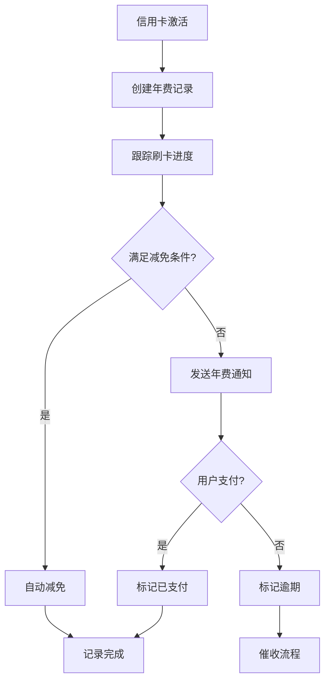

# 年费管理系统设计文档

## 概述

本文档描述了信用卡管理系统中的年费管理模块设计，支持灵活的年费规则配置和自动化的减免条件检查。

## 系统特点

### 🎯 核心功能
- **灵活的年费规则**：支持4种不同类型的年费减免条件
- **自动化管理**：自动创建年费记录和检查减免条件
- **实时统计**：提供详细的年费统计信息
- **批量操作**：支持批量创建记录和检查减免条件

### 📊 支持的年费类型

1. **刚性年费 (rigid)**
   - 不可减免的固定年费
   - 适用于高端信用卡或特定产品

2. **刷卡次数减免 (transaction_count)**
   - 根据年内刷卡次数减免年费
   - 例如：年内刷卡满12次免年费

3. **刷卡金额减免 (transaction_amount)**
   - 根据年内刷卡总金额减免年费
   - 例如：年内刷卡满5万元免年费

4. **积分兑换减免 (points_exchange)**
   - 使用积分兑换年费
   - 例如：2万积分可兑换年费

## 数据库设计

### 表结构

#### 1. annual_fee_rules (年费规则表)
```sql
CREATE TABLE annual_fee_rules (
    id UUID PRIMARY KEY,
    rule_name VARCHAR(100) NOT NULL,              -- 规则名称
    fee_type VARCHAR(20) NOT NULL,                -- 年费类型
    base_fee DECIMAL(10,2) NOT NULL,              -- 基础年费金额
    waiver_condition_value DECIMAL(15,2),         -- 减免条件数值
    waiver_period_months INTEGER DEFAULT 12,      -- 考核周期（月）
    description TEXT,                             -- 规则描述
    created_at TIMESTAMP DEFAULT CURRENT_TIMESTAMP
);
```

#### 2. credit_cards (信用卡表 - 修改)
```sql
-- 移除原有的 annual_fee 字段
-- 添加新字段
ALTER TABLE credit_cards 
DROP COLUMN annual_fee,
ADD COLUMN annual_fee_rule_id UUID REFERENCES annual_fee_rules(id),
ADD COLUMN card_activation_date DATE;
```

#### 3. annual_fee_records (年费记录表)
```sql
CREATE TABLE annual_fee_records (
    id UUID PRIMARY KEY,
    card_id UUID REFERENCES credit_cards(id),
    fee_year INTEGER NOT NULL,                    -- 年费所属年份
    due_date DATE NOT NULL,                       -- 年费到期日期
    fee_amount DECIMAL(10,2) NOT NULL,            -- 应付年费金额
    waiver_status VARCHAR(20) DEFAULT 'pending',  -- 减免状态
    waiver_condition_met BOOLEAN DEFAULT FALSE,   -- 是否满足减免条件
    current_progress DECIMAL(15,2) DEFAULT 0,     -- 当前进度
    payment_date DATE,                            -- 实际支付日期
    notes TEXT,                                   -- 备注
    created_at TIMESTAMP DEFAULT CURRENT_TIMESTAMP,
    updated_at TIMESTAMP DEFAULT CURRENT_TIMESTAMP,
    UNIQUE(card_id, fee_year)
);
```

### 数据库函数

#### 1. create_annual_fee_record()
自动创建年费记录，计算到期日期和年费金额：

```sql
SELECT create_annual_fee_record('card_id', 2024);
```

#### 2. check_annual_fee_waiver()
检查年费减免条件，更新当前进度：

```sql
SELECT check_annual_fee_waiver('card_id', 2024);
```

## API 接口

### 年费规则管理

#### 创建年费规则
```http
POST /annual-fees/rules
Content-Type: application/json

{
    "rule_name": "刷卡次数减免-标准",
    "fee_type": "transaction_count",
    "base_fee": 200.00,
    "waiver_condition_value": 12,
    "waiver_period_months": 12,
    "description": "年内刷卡满12次可减免年费"
}
```

#### 获取年费规则列表
```http
GET /annual-fees/rules?fee_type=transaction_count&skip=0&limit=100
```

### 年费记录管理

#### 自动创建年费记录
```http
POST /annual-fees/records/auto?card_id={uuid}&fee_year=2024
```

#### 获取年费记录
```http
GET /annual-fees/records?card_id={uuid}&fee_year=2024
```

### 年费减免检查

#### 检查单卡减免条件
```http
GET /annual-fees/waiver-check/{card_id}/{fee_year}
```

#### 检查用户所有卡减免条件
```http
GET /annual-fees/waiver-check/user/{user_id}?year=2024
```

### 统计信息

#### 获取年费统计
```http
GET /annual-fees/statistics/{user_id}?year=2024
```

响应示例：
```json
{
    "total_cards": 5,
    "total_annual_fees": 2800.00,
    "waived_fees": 800.00,
    "paid_fees": 1200.00,
    "pending_fees": 600.00,
    "overdue_fees": 200.00,
    "waiver_rate": 28.57
}
```

## 使用场景

### 1. 添加新信用卡
当用户添加新信用卡时：
1. 选择适合的年费规则
2. 设置信用卡激活日期
3. 系统自动关联年费规则

### 2. 年费周期管理
```python
# 为2024年创建年费记录
annual_fee_service.create_annual_fee_record_auto(card_id, 2024)

# 检查减免条件
waiver_check = annual_fee_service.check_annual_fee_waiver(card_id, 2024)
print(f"减免进度: {waiver_check.progress_description}")
```

### 3. 定期检查
系统可以定期运行检查任务：
```python
# 检查用户所有卡的年费状态
waiver_checks = annual_fee_service.check_all_annual_fee_waivers(user_id)

for check in waiver_checks:
    if check.waiver_eligible:
        # 自动更新减免状态
        service.update_annual_fee_record(
            record_id, 
            {"waiver_status": "waived"}
        )
```

### 4. 年费提醒
基于 `due_date` 和 `days_remaining` 发送提醒：
```python
# 获取即将到期的年费
pending_records = service.get_annual_fee_records(
    waiver_status="pending"
)

for record in pending_records:
    if record.days_remaining <= 30:
        send_reminder(record.card_id, record.due_date)
```

## 业务流程

### 年费生命周期



### 减免条件检查流程

1. **刷卡次数检查**
   - 统计年内刷卡笔数
   - 对比减免条件要求
   - 更新进度状态

2. **刷卡金额检查**
   - 统计年内刷卡总额
   - 对比减免条件要求
   - 更新进度状态

3. **积分兑换处理**
   - 检查积分余额
   - 确认兑换意愿
   - 执行兑换操作

## 数据一致性

### 事务处理
- 年费记录创建使用事务确保一致性
- 减免条件检查包含进度更新
- 批量操作支持部分成功处理

### 数据校验
- 年费规则类型枚举校验
- 金额和数值范围校验
- 日期逻辑校验

## 性能优化

### 索引策略
```sql
-- 核心查询索引
CREATE INDEX idx_annual_fee_records_card_year ON annual_fee_records(card_id, fee_year);
CREATE INDEX idx_annual_fee_records_due_date ON annual_fee_records(due_date);
CREATE INDEX idx_annual_fee_records_status ON annual_fee_records(waiver_status);
```

### 缓存策略
- 年费规则数据缓存（变化频率低）
- 用户年费统计缓存（定期更新）
- 减免进度计算结果缓存

## 扩展性

### 未来功能
1. **分期年费**：支持年费分期支付
2. **动态规则**：支持基于用户行为的动态年费规则
3. **年费预测**：基于消费模式预测年费减免可能性
4. **个性化推荐**：推荐最适合的信用卡年费方案

### 接口扩展
- 支持更多年费类型
- 增加年费优惠券功能
- 集成第三方支付平台

---

## 总结

新的年费管理系统提供了：
- ✅ 灵活的年费规则配置
- ✅ 自动化的减免条件检查
- ✅ 完整的年费生命周期管理
- ✅ 丰富的统计和分析功能
- ✅ 可扩展的架构设计

该系统能够满足不同类型信用卡的年费管理需求，并为用户提供透明、便捷的年费服务体验。 